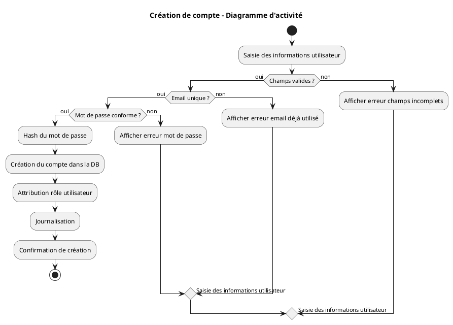
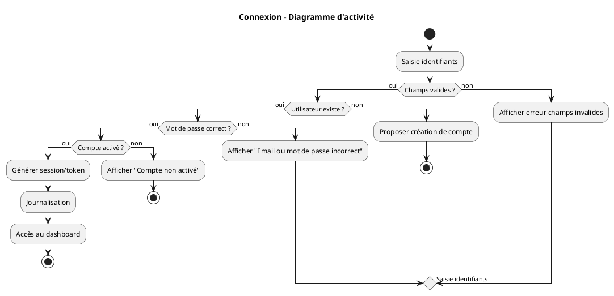
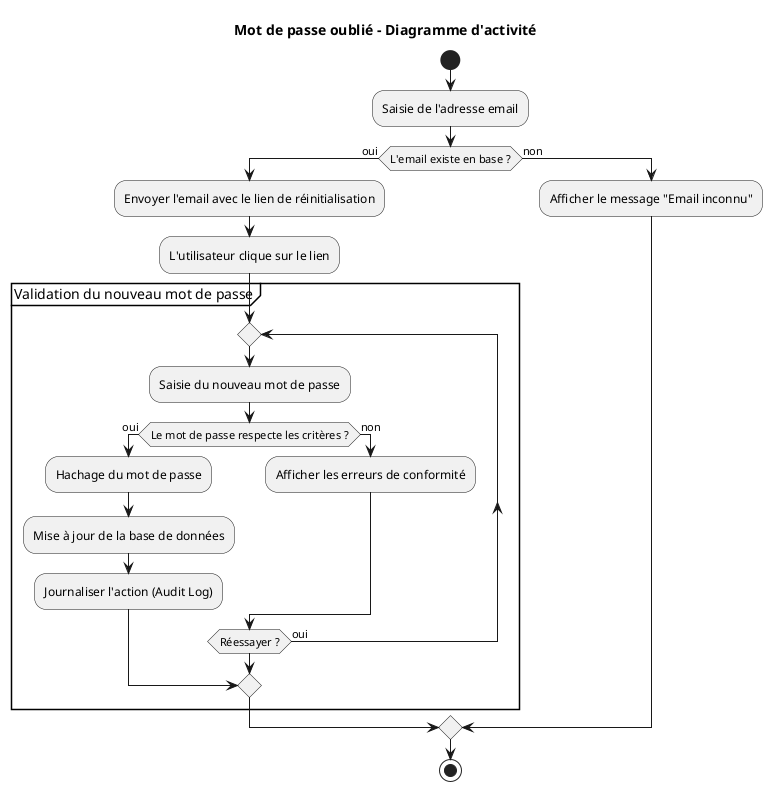
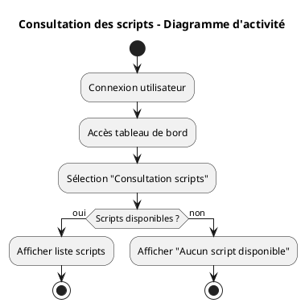
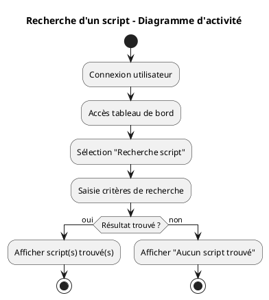
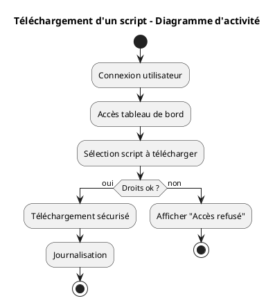
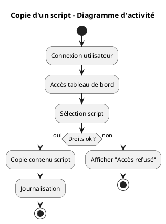
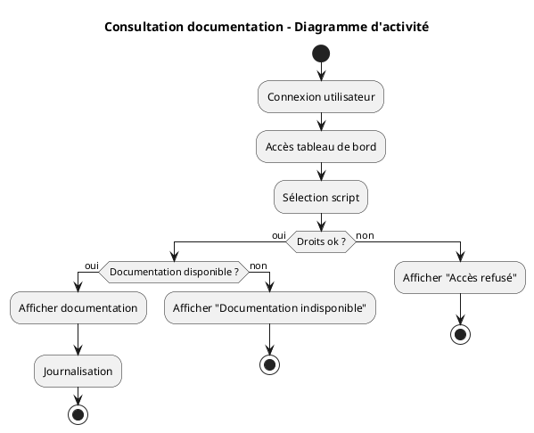
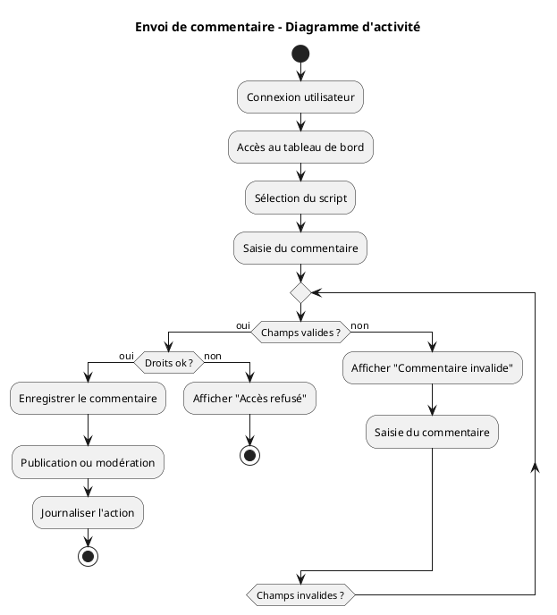
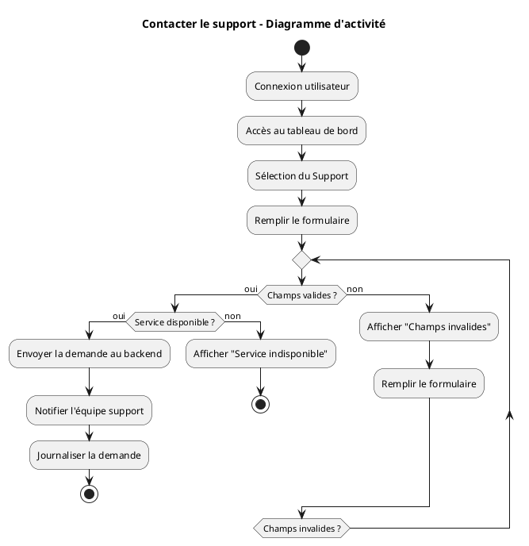

## Diagramme d'activité

## Groupe : 24

### Membres
- Amir Minihadji AMINA  
- LO Pape  
- Neylie NDJUMKENG-NGUEMO  

### Superviseur
- Mhand BOUFALA
---

Dans cette section, nous allons décrire les scénarios des cas d’utilisation suivants, avec leurs flux principaux, alternatifs et erreurs.  
Chaque cas d’utilisation est accompagné d’un diagramme d’activité illustrant le processus complet.

### Cas d’utilisation couverts

1. Création de compte utilisateur
2. Connexion
3. Mot de passe oublié
4. Consultation des scripts
5. Recherche d’un script
6. Téléchargement d’un script
7. Copie d’un script
8. Consultation de la documentation
9. Envoi d’un commentaire
10. Contacter le support

Chaque diagramme ci-dessous présente le **flux nominal**, les **alternatives** et les **erreurs possibles** pour chaque scénario.  

### 1. Création de compte

### 2. Connexion

### 3. Mot de passe oublié

### 4. Consultation des scripts

### 5. Recherche d’un script

### 6. Téléchargement d’un script

### 7. Copie d’un script

### 8. Consultation de la documentation

### 9. Envoi d’un commentaire

### 10. Contacter le support

