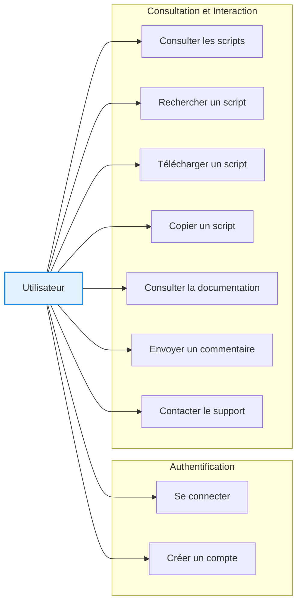
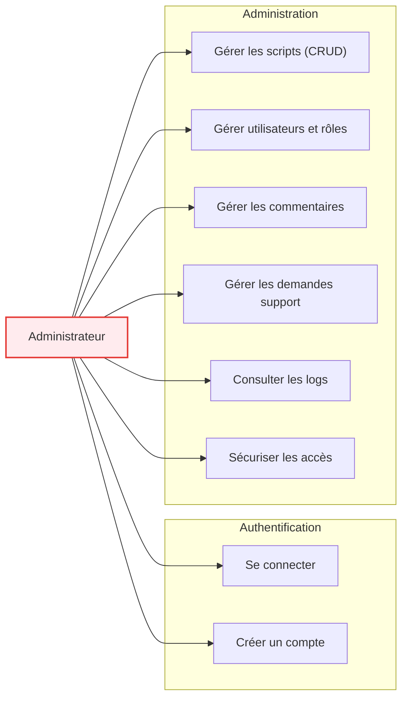
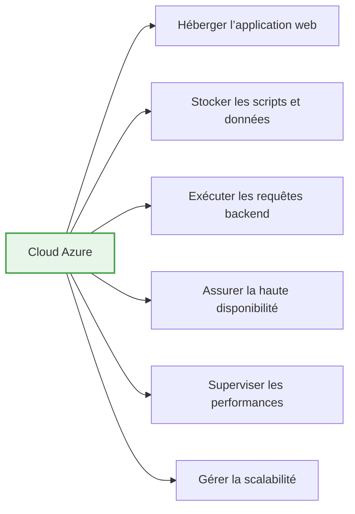
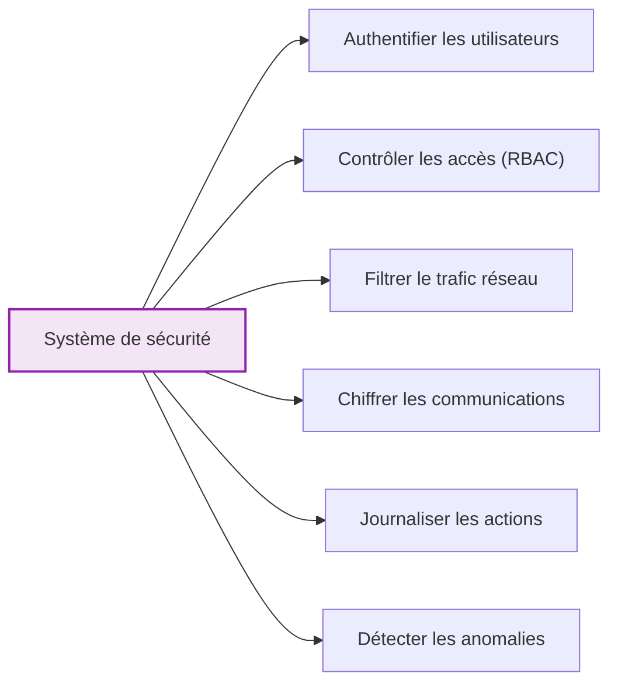
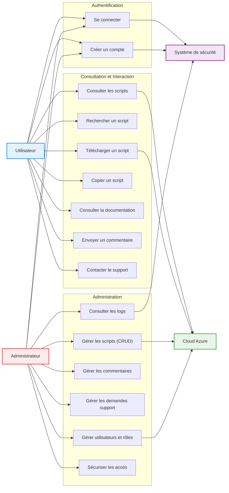

# Projet pédagogique 2026 : Étude de cas d’utilisation

## Groupe : 24

### Membres
- Amir Minihadji AMINA  
- LO Pape  
- Neylie NDJUMKENG-NGUEMO  

### Superviseur
- Mhand BOUFALA
---

Ce document présente l’analyse fonctionnelle du système à travers ses cas d’utilisation. Il permet d’identifier les interactions entre les acteurs et le système, ainsi que les différents scénarios possibles.

## Instructions et rappels
## 1. Diagramme de contexte et acteurs
- Réaliser un diagramme de contexte
- Identifier les acteurs du domaine étudié

## 2. Diagramme de cas d’utilisation
- Concevoir le diagramme de cas d’utilisation :
  - Version textuelle
- Organiser les différents cas d’utilisation

---

## 3. Identification

### 3.1 Acteurs du système
- Définir les acteurs du système

### 3.2 Cas d’utilisation par type d’acteur

#### Utilisateur
- Déterminer les cas d’utilisation associés à l’utilisateur

#### Administrateur
- Déterminer les cas d’utilisation associés à l’administrateur

---

## 4. Description des acteurs

Pour chaque acteur, préciser :

- **Nom**
- **Cas d’utilisation déclenchés**
- **Description textuelle des cas**

---

## 5. Description détaillée des cas d’utilisation

Chaque cas d’utilisation doit contenir :

- **Titre du cas d’utilisation**
- **Résumé**
  - Description
  - Contexte
  - Actions
  - Fonctionnalités
- **Acteur** (nom de l’acteur initiateur)
- **Date de création** : --/--/----
- **Date de mise à jour** : --/--/----
- **Version** : 1.0, 1.1, 1.2, etc.

---

## 6. Scénarios

### 6.1 Scénario principal
- Décrire le déroulement normal du cas d’utilisation

### 6.2 Scénarios alternatifs
- Définir les enchaînements alternatifs

### 6.3 Scénarios d’erreurs
- Définir les enchaînements d’erreurs

---

# Réalisations
## Acteurs du système
Le système **Cloud Script Manager** interagit avec plusieurs acteurs externes :
## 1.1 Description des acteurs
- **Utilisateur**  
  Accède à la plateforme pour consulter, rechercher et utiliser des scripts.
- **Administrateur système**  
  Gère les scripts, les utilisateurs et la sécurité.
- **Système Azure (services cloud)**  
  Fournit l’infrastructure, l’hébergement et les services associés (Cosmos DB, App Service, etc.).
- **Système de sécurité (Firewall, Authentification)**  
  Contrôle les accès et sécurise les communications.

## Acteurs identifiés

### Acteurs principales
- Utilisateur 
- Administrateur système

### Acteurs secondaires
- Système Azure
- AWS
- Système de sécurité

---

# Diagramme de cas d’utilisation

### Utilisateur

- Se connecter
- Créer un compte
- Consulter les scripts
- Rechercher un script
- Télécharger un script
- Copier un script
- Consulter la documentation
- Envoyer un commentaire
- Contacter le support 

Voici le diagramme : 



### Administrateur

- Se connecter
- Créer un compte
- Gérer les scripts (CRUD)
- Gérer les utilisateurs et rôles
- Gérer les commentaires
- Gérer les demandes des utilisateurs via le support 
- Consulter les logs
- Sécuriser les accès

Voici le diagramme : 
 


### Cloud Azure
- Héberger l’application web
- Stocker les scripts et données
- Exécuter les requêtes backend
- Assurer la haute disponibilité
- Superviser les performances
- Gérer la scalabilité

Voici le diagramme : 



### Système de sécurité
- Authentifier les utilisateurs
- Contrôler les accès (RBAC)
- Filtrer le trafic réseau
- Chiffrer les communications
- Journaliser les actions
- Détecter les anomalies

Voici le diagramme :



### Diagramme global

Ce diagramme présente l’ensemble des acteurs du système ainsi que leurs différents cas d’utilisation.



### Code (diagramme)

1. **Mermaid**

```Mermaid
# Diagramme de cas d’utilisation


2. PlantUML

```Plantuml
@startuml
left to right direction
skinparam packageStyle rectangle
skinparam shadowing false

actor "Utilisateur" as User
actor "Administrateur" as Admin
actor "Cloud Azure" as Azure
actor "Système de sécurité" as Security

rectangle "Cloud Script Manager" {

  package "Authentification" {
    usecase "Se connecter" as UC1
    usecase "Créer un compte" as UC2
  }

  package "Consultation et Interaction" {
    usecase "Consulter les scripts" as UC3
    usecase "Rechercher un script" as UC4
    usecase "Télécharger un script" as UC5
    usecase "Copier un script" as UC6
    usecase "Consulter la documentation" as UC7
    usecase "Envoyer un commentaire" as UC8
    usecase "Contacter le support" as UC9
  }

  package "Administration" {
    usecase "Gérer les scripts (CRUD)" as UC10
    usecase "Gérer utilisateurs et rôles" as UC11
    usecase "Gérer les commentaires" as UC12
    usecase "Gérer les demandes support" as UC13
    usecase "Consulter les logs" as UC14
    usecase "Sécuriser les accès" as UC15
  }
}

User -[#1e88e5]-> UC1
User -[#1e88e5]-> UC2
User -[#1e88e5]-> UC3
User -[#1e88e5]-> UC4
User -[#1e88e5]-> UC5
User -[#1e88e5]-> UC6
User -[#1e88e5]-> UC7
User -[#1e88e5]-> UC8
User -[#1e88e5]-> UC9

Admin -[#e53935]-> UC1
Admin -[#e53935]-> UC2
Admin -[#e53935]-> UC10
Admin -[#e53935]-> UC11
Admin -[#e53935]-> UC12
Admin -[#e53935]-> UC13
Admin -[#e53935]-> UC14
Admin -[#e53935]-> UC15

UC3 -[#43a047]-> Azure
UC5 -[#43a047]-> Azure
UC10 -[#43a047]-> Azure
UC11 -[#43a047]-> Azure

UC1 -[#8e24aa]-> Security
UC2 -[#8e24aa]-> Security
UC14 -[#8e24aa]-> Security

@enduml
```

---

## Organisation des cas d’utilisation en bloc

### Bloc Authentification

- Se connecter
- Vérification des droits
- Création de compte

### Bloc Gestion des scripts

- Ajouter un script
- Modifier un script
- Supprimer un script
- Consulter un script
- Télécharger un script 

### Bloc Consultation

- Rechercher
- Télécharger
- Lire documentation

### Bloc Administration

- Gestion utilisateurs
- Gestion rôles
- Gestion des demandes (Support - commentaire)
- Journalisation

---

##  Scénarios
Dans cette partie, nous allons décrire les scénarios des cas d’utilisation suivants :
- Création de compte
- Connexion
- Mot de passe oublié
- Consultation des scripts
- Recherche d’un script
- Téléchargement d’un script
- Copie d’un script
- Consultation de la documentation
- Envoi d’un commentaire
- Contact avec le support


### 1. Cas d’utilisation : Créer un compte 

### Description
Ce cas d’utilisation permet à un utilisateur de créer un compte sécurisé sur la plateforme Cloud Script Manager afin d’accéder aux services de gestion et de consultation des scripts Azure.

### Contexte
- L’utilisateur n’est pas encore authentifié
- Il accède à la plateforme via une interface web
- Le système est disponible et opérationnel
- Les services backend et la base de données sont actifs

### Actions
1. Accès à la page d’inscription
2. Saisie des informations utilisateur
3. Validation côté frontend
4. Envoi des données au backend
5. Vérifications de sécurité
6. Création du compte

### Fonctionnalités
- Formulaire sécurisé
- Validation des champs (frontend + backend)
- Vérification unicité email
- Hash du mot de passe
- Stockage dans la base de données
- Journalisation
- Protection contre abus

**Acteur :** Utilisateur  
**Date de création :** 18/03/2026  
**Date de mise à jour :** 01/04/2026  
**Version :** 1.1


## Scénario 

1. L’utilisateur accède à la page d’accueil de la plateforme.  
2. Le système affiche les options **Connexion** et **Créer un compte**.  
3. L’utilisateur sélectionne **Créer un compte**.  
4. Le système affiche le formulaire d’inscription sécurisé.  
5. L’utilisateur saisit les informations suivantes :  
   - Nom  
   - Prénom  
   - Profession
   - Diplôme
   - Adresse
   - Code postal
   - Rue
   - Pays
   - Ville
   - Adresse email  
   - Mot de passe  
   - Confirmation du mot de passe  
6. Le système effectue une validation côté client (frontend) :  
   - Vérification des champs obligatoires  
   - Format de l’email  
   - Correspondance des mots de passe  
7. L’utilisateur valide le formulaire.  
8. Le système envoie les données via une requête HTTPS vers le backend.  
9. Le backend reçoit la requête et déclenche les vérifications :  
   - Validation des données  
   - Nettoyage des entrées (anti-injection)  
   - Vérification du format  
10. Le système vérifie que l’adresse email n’existe pas déjà dans la base de données.  
11. Le système applique les règles de sécurité :  
    - Complexité du mot de passe  
    - Vérification anti-bot (captcha éventuel)  
12. Le système chiffre (hash) le mot de passe.  
13. Le système crée un nouvel utilisateur dans la base de données (Azure Cosmos DB).  
14. Le système attribue un rôle par défaut (ex : utilisateur standard).  
15. Le système enregistre l’action dans les logs (journalisation).  
16. Le système génère une confirmation de création de compte.  
17. Le système redirige l’utilisateur :  
    - soit vers la page de connexion  
    - soit vers le dashboard (selon configuration)  
18. L’utilisateur accède à son espace personnel.


## Enchaînements alternatifs

### A1 : Email déjà existant (démarre au point 10)
- Le système détecte que l’email est déjà utilisé.  
- La création du compte est rejetée.  
- Message affiché : “Email déjà utilisé”.  
- L’utilisateur modifie son email.  
- Reprise au point 5

### A2 : Mot de passe non conforme (démarre au point 11)
- Le système détecte que le mot de passe ne respecte pas les règles :  
  - trop court  
  - sans caractères spéciaux  
- Le système affiche les exigences de sécurité.  
- L’utilisateur saisit un nouveau mot de passe.  
- Reprise au point 5

### A3 : Champs incomplets ou invalides (démarre au point 6)
- Le système détecte des champs vides ou incorrects.  
- Les champs concernés sont signalés.  
- L’utilisateur corrige les informations.  
- Reprise au point 5

### A4 : Échec captcha / suspicion de bot (démarre au point 11)
- Le système détecte un comportement suspect.  
- Un captcha est demandé ou échoue.  
- L’utilisateur doit recommencer la validation.  
- Reprise au point 7

### A5 : Confirmation email requise (optionnel, démarre au point 16)
- Le système envoie un email de confirmation.  
- L’utilisateur clique sur le lien de validation.  
- Le compte est activé.  
- Reprise vers connexion


## Enchaînements d’erreurs

### E1 : Erreur base de données (démarre au point 13)
- L’enregistrement dans la base échoue (panne Cosmos DB).  
- La création est annulée.  
- Message affiché : “Erreur technique”.  
- Fin en échec

### E2 : Perte de connexion réseau (démarre au point 8)
- La requête n’atteint pas le serveur.  
- Message affiché : “Connexion indisponible”.  
- L’utilisateur doit réessayer.  
- Fin en échec temporaire

### E3 : Attaque ou tentative malveillante (démarre au point 9)
- Le système détecte une injection ou requête suspecte.  
- La requête est bloquée.  
- L’adresse IP peut être temporairement bannie.  
- Fin en échec

### E4 : Service d’authentification indisponible (démarre au point 9)
- Le service backend ne répond pas.  
- Le système retourne une erreur 500.  
- L’utilisateur est informé.  
- Fin en échec

### E5 : Dépassement de tentatives (démarre au point 7)
- Trop de tentatives de création en peu de temps.  
- Le système bloque temporairement la requête.  
- Message affiché : “Veuillez réessayer plus tard”.  
- Fin en échec


## Résultat du cas d’utilisation

### Succès
- Compte créé  
- Données enregistrées  
- Accès possible à la plateforme

### Échec
- Compte non créé  
- Message d’erreur affiché  
- Aucune donnée persistée

---
## 2. Cas d’utilisation : Se connecter 


### Description
Ce cas d’utilisation permet à un utilisateur authentifié d’accéder à la plateforme Cloud Script Manager en saisissant ses identifiants de connexion.

### Contexte
- L’utilisateur possède déjà un compte  
- Il accède à la plateforme via un navigateur  
- Le système est disponible  
- Les services d’authentification sont opérationnels  

### Actions
1. Accès à la page de connexion  
2. Saisie des identifiants  
3. Validation des informations  
4. Authentification  
5. Accès au dashboard  

### Fonctionnalités
- Formulaire de connexion sécurisé  
- Vérification des identifiants  
- Gestion des sessions  
- Gestion des rôles (RBAC)  
- Journalisation des connexions  
- Protection contre attaques  

**Acteur :** Utilisateur  
**Date de création :** 19/03/2026  
**Date de mise à jour :** 02/04/2026  
**Version :** 1.1  


## Scénario 

1. L’utilisateur accède à la page d’accueil de la plateforme.  
2. Le système affiche l’option **Se connecter**.  
3. L’utilisateur sélectionne **Se connecter**.  
4. Le système affiche le formulaire de connexion sécurisé.  
5. L’utilisateur saisit :  
   - Adresse email  
   - Mot de passe  
6. Le système effectue une validation côté frontend :  
   - Champs non vides  
   - Format de l’email  
7. L’utilisateur valide le formulaire.  
8. Le système envoie une requête HTTPS vers le backend.  
9. Le backend reçoit la requête et effectue :  
   - Validation des données  
   - Nettoyage des entrées (anti-injection)  
10. Le système recherche l’utilisateur dans la base de données.  
11. Le système compare le mot de passe saisi avec le mot de passe hashé stocké.  
12. Le système vérifie :  
    - Que le compte est actif  
    - Que les droits sont valides  
13. Le système génère un token de session (JWT ou session).  
14. Le système enregistre la connexion dans les logs.  
15. Le système redirige l’utilisateur vers le dashboard.  
16. L’utilisateur accède à son espace personnel.  


## Enchaînements alternatifs

### A1 : Identifiants incorrects (démarre au point 11)
- Le mot de passe ne correspond pas.  
- L’authentification est refusée.  
- Message affiché : “Email ou mot de passe incorrect”.  
- L’utilisateur ressaisit ses identifiants.  
- Reprise au point 5

### A2 : Compte inexistant (démarre au point 10)
- Aucun utilisateur trouvé avec cet email.  
- Message affiché : “Compte inexistant”.  
- Proposition de créer un compte.  
- Fin ou redirection vers inscription

### A3 : Compte non activé (démarre au point 12)
- Le compte n’est pas activé (email non validé).  
- Connexion refusée.  
- Message affiché : “Veuillez confirmer votre email”.  
- Fin

### A4 : Mot de passe oublié (démarre au point 4)
- L’utilisateur clique sur “Mot de passe oublié”.  
- Le système demande l’email et envoie un lien de réinitialisation.  
- Cas d’utilisation différent

### A5 : Authentification multi-facteurs (MFA, démarre au point 12)
- Le système demande une vérification supplémentaire.  
- L’utilisateur saisit un code reçu (SMS / email / app).  
- Le système valide le code.  
- Reprise au point 13


## Enchaînements d’erreurs

### E1 : Trop de tentatives de connexion (démarre au point 11)
- Plusieurs tentatives échouées détectées.  
- Compte temporairement bloqué.  
- Message affiché : “Compte verrouillé temporairement”.  
- Fin en échec

### E2 : Attaque détectée (sécurité, démarre au point 9)
- Tentative d’injection ou brute force détectée.  
- Requête bloquée.  
- L’adresse IP peut être bannie.  
- Fin en échec

### E3 : Serveur indisponible (démarre au point 8)
- Backend ne répond pas.  
- Message affiché : “Erreur serveur”.  
- Fin en échec

### E4 : Problème base de données (démarre au point 10)
- Impossible d’accéder aux données utilisateur.  
- Message affiché : “Erreur technique”.  
- Fin en échec

### E5 : Session invalide (démarre au point 13)
- Token généré invalide ou corrompu.  
- Système demande une reconnexion.  
- Fin en échec

## Résultat du cas d’utilisation

### Succès
- Utilisateur authentifié  
- Session active  
- Accès au dashboard  

### Échec
- Accès refusé  
- Message d’erreur affiché  
- Aucune session créée

---

## 3. Cas d’utilisation : Mot de passe oublié


### Description
Ce cas d’utilisation permet à un utilisateur ayant oublié son mot de passe de réinitialiser celui-ci afin de retrouver l’accès à la plateforme Cloud Script Manager.

### Contexte
- L’utilisateur possède un compte existant  
- Il ne se souvient plus de son mot de passe  
- Il accède à la plateforme via un navigateur  
- Le système et les services d’authentification sont disponibles  

### Actions
1. Accès à la page de connexion  
2. Sélection de l’option **Mot de passe oublié**  
3. Saisie de l’adresse email associée au compte  
4. Envoi d’un lien de réinitialisation sécurisé par email  
5. Validation du lien  
6. Saisie d’un nouveau mot de passe  
7. Confirmation et mise à jour du mot de passe  

### Fonctionnalités
- Formulaire sécurisé de récupération  
- Vérification de l’existence de l’email  
- Envoi d’un email de réinitialisation  
- Lien temporaire et sécurisé (token unique)  
- Validation du nouveau mot de passe selon la politique de sécurité  
- Journalisation des actions  

**Acteur :** Utilisateur  
**Date de création :** 20/03/2026  
**Date de mise à jour :** 02/04/2026  
**Version :** 1.2  


## Scénario 

1. L’utilisateur accède à la page de connexion de la plateforme.  
2. Le système affiche l’option **Mot de passe oublié**.  
3. L’utilisateur clique sur **Mot de passe oublié**.  
4. Le système affiche le formulaire de saisie de l’adresse email.  
5. L’utilisateur saisit son adresse email.  
6. Le système vérifie que l’email est associé à un compte existant.  
7. Le système envoie un email contenant un lien sécurisé de réinitialisation.  
8. L’utilisateur ouvre l’email et clique sur le lien.  
9. Le système valide le token du lien (durée limitée).  
10. Le système affiche un formulaire pour saisir un nouveau mot de passe.  
11. L’utilisateur saisit et confirme le nouveau mot de passe.  
12. Le système valide que le mot de passe respecte la politique de sécurité.  
13. Le système met à jour le mot de passe dans la base de données (hashé).  
14. Le système enregistre l’action dans les logs.  
15. Le système affiche un message de confirmation et redirige l’utilisateur vers la page de connexion.  

## Enchaînements alternatifs

### A1 : Email inconnu (démarre au point 6)
- L’email saisi n’est associé à aucun compte.  
- Message affiché : “Email inconnu”.  
- L’utilisateur peut ressaisir un email valide ou créer un compte.  
- Fin ou retour au point 5

### A2 : Lien expiré ou invalide (démarre au point 9)
- Le token du lien a expiré ou est invalide.  
- Message affiché : “Lien invalide ou expiré”.  
- L’utilisateur peut redemander un nouveau lien.  
- Reprise au point 3

### A3 : Mot de passe non conforme (démarre au point 12)
- Le mot de passe saisi ne respecte pas la politique de sécurité (trop court, pas de caractère spécial).  
- Message affiché : “Mot de passe non conforme”.  
- L’utilisateur saisit un nouveau mot de passe.  
- Reprise au point 10

### A4 : Problème de réception d’email (démarre au point 7)
- L’email de réinitialisation n’arrive pas (filtrage SPAM, problème serveur mail).  
- L’utilisateur peut demander de renvoyer le lien.  
- Reprise au point 7

## Enchaînements d’erreurs

### E1 : Serveur indisponible (démarre au point 7)
- Le service d’envoi d’email est indisponible.  
- Message affiché : “Service temporairement indisponible”.
- Fin en échec temporaire

### E2 : Problème base de données (démarre au point 13)
- Impossible de mettre à jour le mot de passe.  
- Message affiché : “Erreur technique”.  
- Fin en échec

### E3 : Tentatives abusives (démarre au point 3)
- Trop de demandes de réinitialisation en peu de temps.  
- L’accès est temporairement bloqué.  
- Message affiché : “Veuillez réessayer plus tard”.  
- Fin en échec

## Résultat du cas d’utilisation

### Succès
- L’utilisateur reçoit le lien de réinitialisation  
- Le mot de passe est mis à jour  
- Accès possible à la plateforme  

### Échec
- Mot de passe non modifié  
- Message d’erreur affiché  
- Aucune modification dans la base de données

---

## 4. Cas d’utilisation : Consultation des scripts

### Description
Ce cas d’utilisation permet à un utilisateur de consulter, rechercher et accéder aux scripts disponibles sur la plateforme Cloud Script Manager afin d’exploiter ou d’étudier les scripts Azure ou AWS.

### Contexte
- L’utilisateur est authentifié sur la plateforme  
- La plateforme et les services backend sont disponibles  
- La base de données contenant les scripts est opérationnelle  
- Les permissions d’accès de l’utilisateur sont validées  

### Actions
1. Accès à la page de consultation des scripts  
2. Affichage de la liste des scripts disponibles  
3. Recherche et filtrage des scripts selon des critères (nom, type, date)  
4. Sélection d’un script  
5. Lecture des détails du script  
6. Téléchargement ou copie du script si autorisé  

### Fonctionnalités
- Affichage de la liste des scripts avec pagination  
- Recherche et filtrage avancé  
- Affichage des détails du script (nom, auteur, date, description)  
- Téléchargement sécurisé  
- Copie sécurisée du contenu  
- Journalisation des actions  

**Acteur :** Utilisateur  
**Date de création :** 21/03/2026  
**Date de mise à jour :**  pas encore  
**Version :** 1.0  

---

## Scénario

1. L’utilisateur accède à la page **Consultation des scripts** depuis le dashboard.  
2. Le système affiche la liste des scripts disponibles.  
3. L’utilisateur peut utiliser la barre de recherche pour filtrer les scripts :  
   - Par nom  
   - Par catégorie/type  
   - Par date de création  
4. L’utilisateur sélectionne un script spécifique.  
5. Le système affiche les détails du script :  
   - Nom  
   - Auteur  
   - Date de création  
   - Description  
   - Contenu du script   
   - Documentation
   - Exemples en prod 
   - autres
6. L’utilisateur peut :  
   - Télécharger le script  
   - Copier le contenu  
   - Consulter la documentation associée  
7. Le système journalise l’action de consultation, téléchargement ou copie.  
8. L’utilisateur peut retourner à la liste ou continuer la recherche.  

## Enchaînements alternatifs

### A1 : Script non trouvé (démarre au point 3)
- Aucun script ne correspond aux critères de recherche.  
- Message affiché : “Aucun script trouvé”.  
- L’utilisateur peut modifier les critères de recherche.
- Reprise au point 3

### A2 : Accès restreint (démarre au point 6)
- L’utilisateur tente de télécharger ou copier un script pour lequel il n’a pas les droits.  
- Message affiché : “Accès refusé”.  
- L’utilisateur peut consulter uniquement le contenu en lecture seule.  
- Fin ou retour à la consultation

### A3 : Problème de chargement (démarre au point 2)
- La liste des scripts ne se charge pas (problème serveur ou base).  
- Message affiché : “Erreur de chargement des scripts”.  
- L’utilisateur peut réessayer plus tard.  
- Fin en échec temporaire

### A4 : Documentation indisponible (démarre au point 6)
- La documentation associée à un script est introuvable ou corrompue.  
- Message affiché : “Documentation indisponible”.  
- L’utilisateur peut consulter le script mais sans documentation.  
- Reprise au point 5

## Enchaînements d’erreurs

### E1 : Base de données indisponible (démarre au point 2)
- Le système ne peut récupérer les scripts depuis la base.  
- Message affiché : “Service temporairement indisponible”.
- Fin en échec

### E2 : Problème de téléchargement (démarre au point 6)
- Le téléchargement échoue à cause d’un problème réseau ou serveur.  
- Message affiché : “Erreur lors du téléchargement”.  
- Fin en échec temporaire

### E3 : Session expirée (démarre au point 1 ou 2)
- L’utilisateur n’est plus authentifié.  
- Redirection vers la page de connexion.  
- Fin ou reprise après authentification


## Résultat du cas d’utilisation

### Succès
- Scripts consultés avec succès  
- Recherche et filtrage fonctionnels  
- Téléchargement ou copie effectués selon droits  
- Actions journalisées  

### Échec
- Consultation impossible  
- Message d’erreur affiché  
- Aucune action n’est enregistrée

---

## 5. Cas d’utilisation : Recherche d’un script

### Description
Ce cas d’utilisation permet à un utilisateur de rechercher un script spécifique sur la plateforme Cloud Script Manager en utilisant différents critères afin de trouver rapidement le script souhaité.

### Contexte
- L’utilisateur est authentifié  
- La plateforme et les services backend sont disponibles  
- La base de données contenant les scripts est opérationnelle  
- L’utilisateur souhaite filtrer ou localiser un script précis  

### Actions
1. Accès à la page de consultation ou recherche de scripts  
2. Saisie des critères de recherche  
3. Lancement de la recherche  
4. Affichage des résultats correspondants  
5. Sélection d’un script pour consultation ou téléchargement  

### Fonctionnalités
- Barre de recherche avec saisie libre  
- Filtres avancés : nom, auteur, catégorie, date de création  
- Résultats affichés avec pagination  
- Sélection et consultation du script depuis les résultats  
- Journalisation de la recherche  

**Acteur :** Utilisateur  
**Date de création :** 22/03/2026  
**Date de mise à jour :** pas encore  
**Version :** 1.0  

---

## Scénario 

1. L'utilisateur se connecte et accède au tableau de bord
2. L’utilisateur accède à la page **Recherche de scripts** depuis le dashboard ou la page de consultation.  
3. Le système affiche un champ de saisie pour la recherche et les filtres disponibles.  
4. L’utilisateur saisit un mot-clé ou plusieurs critères :  
   - Nom du script  
   - Auteur  
   - Catégorie/type  
   - Date de création  
5. L’utilisateur clique sur **Rechercher**.  
6. Le système envoie la requête au backend via HTTPS.  
7. Le backend effectue la recherche dans la base de données et retourne les résultats correspondants.  
8. Le système affiche la liste des scripts correspondants avec :  
   - Nom  
   - Auteur  
   - Date  
   - Description  
   - autres
9. L’utilisateur sélectionne un script pour consulter ses détails, le télécharger ou le copier selon ses droits.  
10. Le système journalise la recherche et les actions effectuées.  

## Enchaînements alternatifs

### A1 : Aucun résultat trouvé (démarre au point 6)
- Aucun script ne correspond aux critères de recherche.  
- Message affiché : “Aucun script trouvé”.  
- L’utilisateur peut modifier les critères ou élargir la recherche.  
- Reprise au point 3

### A2 : Critères invalides (démarre au point 3)
- Les critères saisis sont invalides (caractères spéciaux interdits, longueur excessive).  
- Message affiché : “Critères invalides”.  
- L’utilisateur corrige les critères.  
- Reprise au point 3

### A3 : Accès restreint (démarre au point 8)
- L’utilisateur tente d’accéder à un script pour lequel il n’a pas de droits.  
- Message affiché : “Accès refusé”.  
- Fin ou retour aux résultats  

### A4 : Recherche interrompue (démarre au point 5)
- La recherche échoue à cause d’un problème réseau ou serveur.  
- Message affiché : “Erreur lors de la recherche”.  
- L’utilisateur peut réessayer.  
- Reprise au point 4


## Enchaînements d’erreurs

### E1 : Base de données indisponible (démarre au point 5)
- Le système ne peut interroger la base de données.  
- Message affiché : “Service temporairement indisponible”.  
- Fin en échec

### E2 : Session expirée (démarre au point 1 ou 5)
- L’utilisateur n’est plus authentifié.  
- Redirection vers la page de connexion.  
- Fin ou reprise après authentification

## Résultat du cas d’utilisation

### Succès
- Scripts correspondant aux critères affichés  
- L’utilisateur peut consulter, télécharger ou copier les scripts selon ses droits  
- Recherche journalisée  

### Échec
- Aucun résultat affiché ou recherche impossible  
- Message d’erreur affiché  
- Aucune action enregistrée

---
## 6. Cas d’utilisation : Téléchargement d’un script

### Description
Ce cas d’utilisation permet à un utilisateur authentifié de télécharger un script depuis la plateforme Cloud Script Manager afin de l’utiliser localement ou dans un projet Azure ou AWS.

### Contexte
- L’utilisateur est authentifié et a accédé au tableau de bord  
- La plateforme et les services backend sont disponibles  
- La base de données contenant les scripts est opérationnelle  
- L’utilisateur possède les droits nécessaires pour télécharger le script  

### Actions
1. Connexion de l’utilisateur et accès au tableau de bord  
2. Navigation vers la page de consultation des scripts  
3. Sélection du script à télécharger  
4. Vérification des droits d’accès  
5. Téléchargement sécurisé du script  
6. Journalisation de l’action  

### Fonctionnalités
- Authentification obligatoire  
- Vérification des droits (RBAC)  
- Téléchargement via HTTPS  
- Gestion des erreurs et messages  
- Journalisation des téléchargements  

**Acteur :** Utilisateur  
**Date de création :** 23/03/2026  
**Date de mise à jour :** pas encore  
**Version :** 1.0  

---

## Scénario 

1. L’utilisateur se connecte à la plateforme et accède au tableau de bord.  
2. Le système affiche le tableau de bord avec les options disponibles.  
3. L’utilisateur sélectionne **Consultation des scripts**.  
4. Le système affiche la liste des scripts disponibles.  
5. L’utilisateur choisit le script à télécharger.  
6. Le système vérifie les droits de l’utilisateur pour ce script.  
7. Si l’accès est autorisé, le système prépare le téléchargement sécurisé via HTTPS.  
8. L’utilisateur confirme le téléchargement et le fichier est transféré vers son poste.  
9. Le système enregistre l’action dans les logs.  
10. L’utilisateur peut continuer à naviguer ou télécharger d’autres scripts.  

## Enchaînements alternatifs

### A1 : Script non trouvé (démarre au point 5)
- Le script sélectionné n’existe pas ou a été supprimé.  
- Message affiché : “Script introuvable”. 
- Retour à la liste des scripts  

### A2 : Accès non autorisé (démarre au point 6)
- L’utilisateur n’a pas les droits pour télécharger ce script.  
- Message affiché : “Accès refusé”.  
- Fin ou retour à la liste des scripts  

### A3 : Téléchargement interrompu (démarre au point 8)
- La connexion est interrompue ou le serveur rencontre un problème pendant le transfert.  
- Message affiché : “Erreur lors du téléchargement”.  
- L’utilisateur peut réessayer.  
- Reprise au point 8  

### A4 : Session expirée (démarre au point 1 ou 6)
- L’utilisateur n’est plus authentifié.  
- Redirection vers la page de connexion.  
- Fin ou reprise après authentification  


## Enchaînements d’erreurs

### E1 : Base de données indisponible (démarre au point 4)
- Impossible de récupérer les informations sur le script.  
- Message affiché : “Service temporairement indisponible”.  
- Fin en échec  

### E2 : Problème réseau (démarre au point 8)
- Le téléchargement échoue en raison d’un problème réseau.  
- Message affiché : “Erreur réseau, veuillez réessayer”.
- Fin en échec temporaire  

### E3 : Tentatives abusives (démarre au point 8)
- Trop de téléchargements en peu de temps détectés.  
- L’accès est temporairement bloqué.  
- Message affiché : “Veuillez réessayer plus tard”.  
- Fin en échec  


## Résultat du cas d’utilisation

### Succès
- Script téléchargé avec succès  
- Action journalisée  
- L’utilisateur peut accéder au script localement  

### Échec
- Téléchargement impossible  
- Message d’erreur affiché  
- Aucune action non autorisée n’est enregistrée

---
## 7. Cas d’utilisation : Copie d’un script

### Description
Ce cas d’utilisation permet à un utilisateur authentifié de copier le contenu d’un script depuis la plateforme Cloud Script Manager afin de le coller dans un environnement local ou un projet Azure ou AWS.

### Contexte
- L’utilisateur est authentifié et a accès au tableau de bord  
- La plateforme et les services backend sont disponibles  
- La base de données contenant les scripts est opérationnelle  
- L’utilisateur possède les droits nécessaires pour copier le script  

### Actions
1. Connexion de l’utilisateur et accès au tableau de bord  
2. Navigation vers la page de consultation des scripts  
3. Sélection du script à copier  
4. Vérification des droits d’accès  
5. Copie sécurisée du contenu du script dans le presse-papiers  
6. Journalisation de l’action  

### Fonctionnalités
- Authentification obligatoire  
- Vérification des droits (RBAC)  
- Copie sécurisée du contenu du script  
- Gestion des erreurs et messages  
- Journalisation des actions  

**Acteur :** Utilisateur  
**Date de création :** 24/03/2026  
**Date de mise à jour :**  pas encore  
**Version :** 1.0  


## Scénario

1. L’utilisateur se connecte à la plateforme et accède au tableau de bord.  
2. Le système affiche le tableau de bord avec les options disponibles.  
3. L’utilisateur sélectionne **Consultation des scripts**.  
4. Le système affiche la liste des scripts disponibles.  
5. L’utilisateur choisit le script dont il souhaite copier le contenu.  
6. Le système vérifie que l’utilisateur a les droits nécessaires pour copier ce script.  
7. Si l’accès est autorisé, le système met le contenu du script dans le presse-papiers de manière sécurisée.  
8. Le système journalise l’action de copie.  
9. L’utilisateur peut continuer à naviguer, copier d’autres scripts ou télécharger le script si nécessaire.  


## Enchaînements alternatifs

### A1 : Script non trouvé (démarre au point 5)
- Le script sélectionné n’existe pas ou a été supprimé.  
- Message affiché : “Script introuvable”.  
- Retour à la liste des scripts  

### A2 : Accès non autorisé (démarre au point 6)
- L’utilisateur n’a pas les droits pour copier ce script.  
- Message affiché : “Accès refusé”.  
- Fin ou retour à la liste des scripts  

### A3 : Session expirée (démarre au point 1 ou 6)
- L’utilisateur n’est plus authentifié.  
- Redirection vers la page de connexion.  
- Fin ou reprise après authentification  

### A4 : Problème technique (démarre au point 7)
- La copie échoue à cause d’un problème serveur ou navigateur.  
- Message affiché : “Erreur lors de la copie”.  
- L’utilisateur peut réessayer.  
- Reprise au point 7  


## Enchaînements d’erreurs

### E1 : Base de données indisponible (démarre au point 4)
- Le système ne peut récupérer le contenu du script.  
- Message affiché : “Service temporairement indisponible”.  
- Fin en échec  

### E2 : Tentatives abusives (démarre au point 7)
- Trop de copies détectées en peu de temps.  
- L’accès est temporairement bloqué.  
- Message affiché : “Veuillez réessayer plus tard”.  
- Fin en échec  


## Résultat du cas d’utilisation

### Succès
- Contenu du script copié avec succès  
- Action journalisée  
- L’utilisateur peut coller le script dans son environnement local  

### Échec
- Copie impossible  
- Message d’erreur affiché  
- Aucune action non autorisée n’est enregistrée

---

## 8. Cas d’utilisation : Consultation de la documentation d’un script

### Description
Ce cas d’utilisation permet à un utilisateur authentifié de consulter la documentation associée à un script sur la plateforme Cloud Script Manager afin de mieux comprendre son fonctionnement et son utilisation.

### Contexte
- L’utilisateur est authentifié et a accès au tableau de bord  
- La plateforme et les services backend sont disponibles  
- La base de données contenant les scripts et leur documentation est opérationnelle  
- L’utilisateur possède les droits nécessaires pour accéder à la documentation  

### Actions
1. Connexion de l’utilisateur et accès au tableau de bord  
2. Navigation vers la page de consultation des scripts  
3. Sélection du script dont l’utilisateur souhaite consulter la documentation  
4. Vérification des droits d’accès  
5. Affichage de la documentation détaillée  
6. Journalisation de l’action  

### Fonctionnalités
- Authentification obligatoire  
- Vérification des droits (RBAC)  
- Affichage sécurisé de la documentation  
- Pagination ou sections pour faciliter la lecture  
- Journalisation des consultations  

**Acteur :** Utilisateur  
**Date de création :** 25/03/2026  
**Date de mise à jour :** pas encore  
**Version :** 1.0  

---

## Scénario 

1. L’utilisateur se connecte à la plateforme et accède au tableau de bord.  
2. Le système affiche le tableau de bord avec les options disponibles.  
3. L’utilisateur sélectionne **Consultation des scripts**.  
4. Le système affiche la liste des scripts disponibles.  
5. L’utilisateur choisit le script dont il souhaite consulter la documentation.  
6. Le système vérifie les droits de l’utilisateur pour accéder à la documentation.  
7. Si l’accès est autorisé, la documentation complète du script est affichée, comprenant :  
   - Objectif et description du script  
   - Paramètres et variables utilisés  
   - Instructions d’exécution  
   - Exemples d’usage  
   - Notes et commentaires supplémentaires  
   - Liens
8. Le système journalise l’action de consultation.  
9. L’utilisateur peut revenir à la liste des scripts ou consulter un autre script.  


## Enchaînements alternatifs

### A1 : Documentation indisponible (démarre au point 7)
- La documentation du script est introuvable ou corrompue.  
- Message affiché : “Documentation indisponible”.  
- L’utilisateur peut consulter uniquement le script.
- Retour au point 5  

### A2 : Accès non autorisé (démarre au point 6)
- L’utilisateur n’a pas les droits pour consulter la documentation.  
- Message affiché : “Accès refusé”.  
- Fin ou retour à la liste des scripts  

### A3 : Session expirée (démarre au point 1 ou 6)
- L’utilisateur n’est plus authentifié.  
- Redirection vers la page de connexion.  
- Fin ou reprise après authentification  

### A4 : Problème technique (démarre au point 7)
- L’affichage de la documentation échoue à cause d’un problème serveur ou navigateur.  
- Message affiché : “Erreur lors de l’affichage de la documentation”.  
- L’utilisateur peut réessayer.  
- Reprise au point 7  

## Enchaînements d’erreurs

### E1 : Base de données indisponible (démarre au point 5)
- Le système ne peut récupérer la documentation du script.  
- Message affiché : “Service temporairement indisponible”.  
- Fin en échec  

### E2 : Session expirée pendant consultation (démarre au point 7)
- L’utilisateur n’est plus authentifié.  
- Redirection vers la page de connexion.  
- Fin ou reprise après authentification  

## Résultat du cas d’utilisation

### Succès
- Documentation consultée avec succès  
- Action journalisée  
- L’utilisateur comprend le script et peut l’utiliser correctement  

### Échec
- Documentation inaccessible  
- Message d’erreur affiché  
- Aucune action non autorisée n’est enregistrée

---

## 9. Cas d’utilisation : Envoi d’un commentaire

### Description
Ce cas d’utilisation permet à un utilisateur authentifié d’envoyer un commentaire sur un script dans la plateforme Cloud Script Manager afin de partager des retours, poser des questions ou proposer des améliorations.

### Contexte
- L’utilisateur est authentifié et a accès au tableau de bord  
- La plateforme et les services backend sont disponibles  
- La base de données stockant les commentaires est opérationnelle  
- L’utilisateur possède les droits nécessaires pour commenter le script  

### Actions
1. Connexion de l’utilisateur et accès au tableau de bord  
2. Navigation vers la page de consultation des scripts  
3. Sélection du script sur lequel l’utilisateur souhaite commenter  
4. Saisie du commentaire dans le formulaire prévu  
5. Validation et envoi du commentaire au backend  
6. Vérification des règles de sécurité et modération automatique  
7. Publication du commentaire  
8. Journalisation de l’action  

### Fonctionnalités
- Authentification obligatoire  
- Formulaire de saisie sécurisé  
- Vérification anti-injection et filtrage de contenu  
- Gestion des droits d’accès (RBAC)  
- Publication instantanée ou modérée selon règles  
- Journalisation des commentaires  

**Acteur :** Utilisateur  
**Date de création :** 26/03/2026  
**Date de mise à jour :** pas encore  
**Version :** 1.0  

## Scénario 

1. L’utilisateur se connecte à la plateforme et accède au tableau de bord.  
2. Le système affiche le tableau de bord avec les options disponibles.  
3. L’utilisateur sélectionne **Consultation des scripts**.  
4. Le système affiche la liste des scripts disponibles.  
5. L’utilisateur choisit le script sur lequel il souhaite commenter.  
6. Le système affiche le formulaire de commentaire sous le script sélectionné.  
7. L’utilisateur saisit son commentaire et clique sur **Envoyer**.  
8. Le système effectue les vérifications suivantes :  
   - Filtrage de contenu (profanités, liens malveillants)  
   - Anti-injection et validation de la longueur du texte  
   - Vérification des droits d’accès  
9. Le système enregistre le commentaire dans la base de données et le publie selon les règles de modération.  
10. Le système journalise l’action et affiche le commentaire dans la section dédiée.  
11. L’utilisateur peut consulter ou envoyer d’autres commentaires.  


## Enchaînements alternatifs

### A1 : Commentaire vide ou invalide (démarre au point 7)
- Le champ commentaire est vide ou dépasse la longueur maximale.  
- Message affiché : “Commentaire invalide”.  
- L’utilisateur modifie le texte et réessaye.  
- Reprise au point 7  

### A2 : Accès non autorisé (démarre au point 6)
- L’utilisateur n’a pas les droits pour commenter ce script.  
- Message affiché : “Accès refusé”.  
- Fin ou retour à la liste des scripts  

### A3 : Session expirée (démarre au point 1 ou 7)
- L’utilisateur n’est plus authentifié.  
- Redirection vers la page de connexion.  
- Fin ou reprise après authentification  

### A4 : Modération en attente (optionnel, démarre au point 9)
- Le commentaire nécessite validation par un administrateur.  
- Message affiché : “Votre commentaire sera publié après validation”.  
- Fin nominal  

## Enchaînements d’erreurs

### E1 : Base de données indisponible (démarre au point 9)
- Le système ne peut enregistrer le commentaire.  
- Message affiché : “Service temporairement indisponible”.  
- Fin en échec  

### E2 : Problème réseau (démarre au point 8)
- L’envoi échoue à cause d’un problème réseau.  
- Message affiché : “Erreur lors de l’envoi du commentaire”.  
- L’utilisateur peut réessayer.  
- Reprise au point 7  

### E3 : Tentatives abusives (démarre au point 7)
- Trop de commentaires envoyés en peu de temps.  
- L’accès est temporairement bloqué.  
- Message affiché : “Veuillez réessayer plus tard”.  
- Fin en échec  

## Résultat du cas d’utilisation

### Succès
- Commentaire publié ou en attente de validation  
- Action journalisée  
- L’utilisateur peut voir son commentaire ou continuer à interagir  

### Échec
- Commentaire non publié  
- Message d’erreur affiché  
- Aucune action non autorisée n’est enregistrée

---

## 10. Cas d’utilisation : Contacter le support

### Description
Ce cas d’utilisation permet à un utilisateur authentifié de contacter l’équipe de support de la plateforme Cloud Script Manager pour signaler un problème, poser une question ou demander de l’assistance.

### Contexte
- L’utilisateur est authentifié et a accès au tableau de bord  
- La plateforme et les services backend sont disponibles  
- Le système de support (ticketing ou messagerie) est opérationnel  
- L’utilisateur possède les droits nécessaires pour envoyer une demande  

### Actions
1. Connexion de l’utilisateur et accès au tableau de bord  
2. Navigation vers la section **Support**  
3. Sélection de l’option **Contacter le support**  
4. Saisie des informations du message (objet, description, catégorie)  
5. Validation et envoi de la demande  
6. Vérification des règles de sécurité et formatage du ticket  
7. Enregistrement de la demande dans le système de support  
8. Notification à l’équipe support  
9. Journalisation de l’action  

### Fonctionnalités
- Authentification obligatoire  
- Formulaire sécurisé de contact  
- Validation des champs obligatoires  
- Catégorisation des demandes  
- Transmission sécurisée via HTTPS  
- Journalisation des interactions  

**Acteur :** Utilisateur  
**Date de création :** 27/03/2026  
**Date de mise à jour :** pas encore  
**Version :** 1.0  


## Scénario 

1. L’utilisateur se connecte à la plateforme et accède au tableau de bord.  
2. Le système affiche le tableau de bord avec les options disponibles.  
3. L’utilisateur sélectionne **Support** puis **Contacter le support**.  
4. Le système affiche le formulaire de contact sécurisé.  
5. L’utilisateur saisit :  
   - Objet du message  
   - Description détaillée du problème ou de la demande  
   - Catégorie ou priorité éventuelle  
6. L’utilisateur clique sur **Envoyer**.  
7. Le système effectue les vérifications suivantes :  
   - Champs obligatoires remplis  
   - Format du texte correct  
   - Pas de contenu malveillant  
8. Le système enregistre la demande dans le système de support et notifie l’équipe concernée.  
9. Le système journalise l’action et confirme l’envoi à l’utilisateur.  
10. L’utilisateur peut suivre le statut de sa demande dans l’interface **Support**.  


## Enchaînements alternatifs

### A1 : Champs obligatoires manquants (démarre au point 5)
- L’utilisateur n’a pas rempli tous les champs obligatoires.  
- Message affiché : “Veuillez compléter tous les champs obligatoires”.  
- Reprise au point 5  

### A2 : Session expirée (démarre au point 1 ou 5)
- L’utilisateur n’est plus authentifié.  
- Redirection vers la page de connexion.  
- Fin ou reprise après authentification  

### A3 : Contenu non autorisé ou malveillant (démarre au point 6)
- Le message contient des liens ou caractères suspects.  
- Message affiché : “Contenu non autorisé”.  
- Reprise au point 5  

## Enchaînements d’erreurs

### E1 : Base de données indisponible (démarre au point 7)
- Le système ne peut enregistrer la demande.  
- Message affiché : “Service temporairement indisponible”. 
- Fin en échec  

### E2 : Problème réseau (démarre au point 6 ou 7)
- La demande n’atteint pas le serveur.  
- Message affiché : “Erreur lors de l’envoi, veuillez réessayer”.  
- Fin en échec temporaire  

### E3 : Tentatives abusives (démarre au point 6)
- Trop de demandes envoyées en peu de temps.  
- L’accès est temporairement bloqué.  
- Message affiché : “Veuillez réessayer plus tard”.  
- Fin en échec  


## Résultat du cas d’utilisation

### Succès
- Demande enregistrée et transmise au support  
- Action journalisée  
- L’utilisateur reçoit une confirmation et peut suivre le statut  

### Échec
- Demande non envoyée  
- Message d’erreur affiché  
- Aucune action non autorisée n’est enregistrée

---

