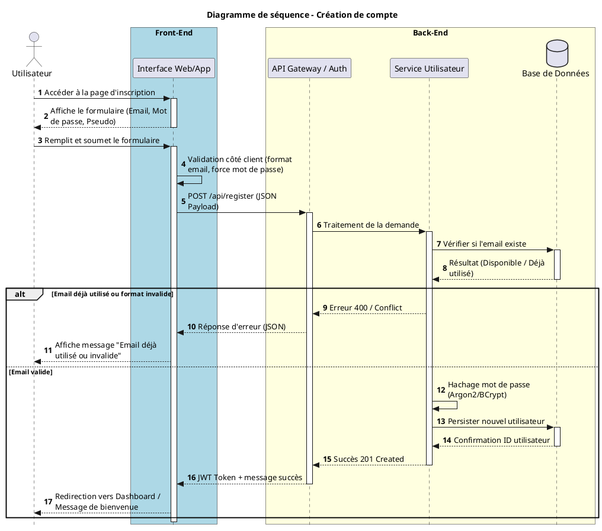
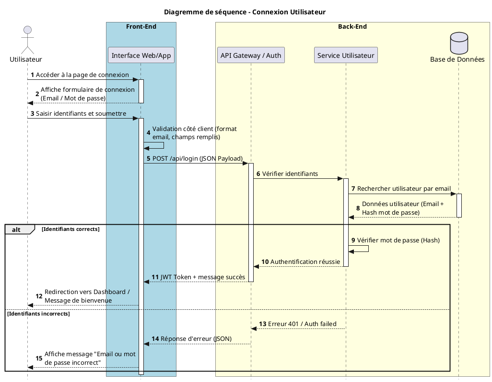
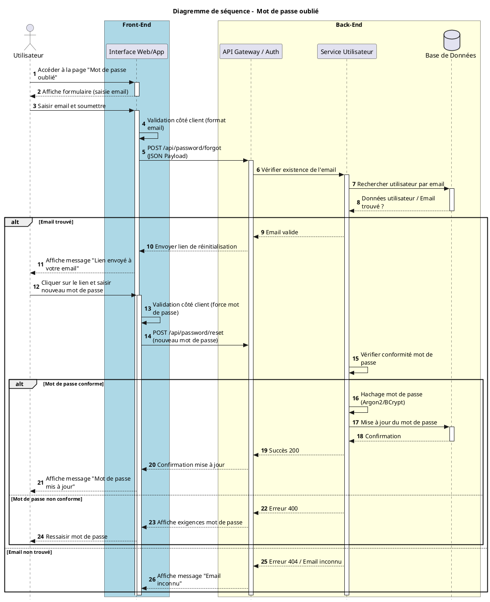
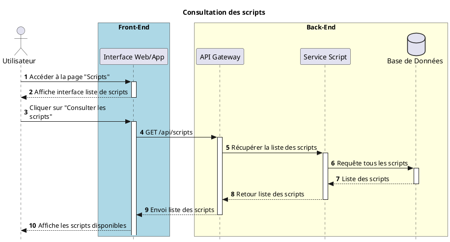
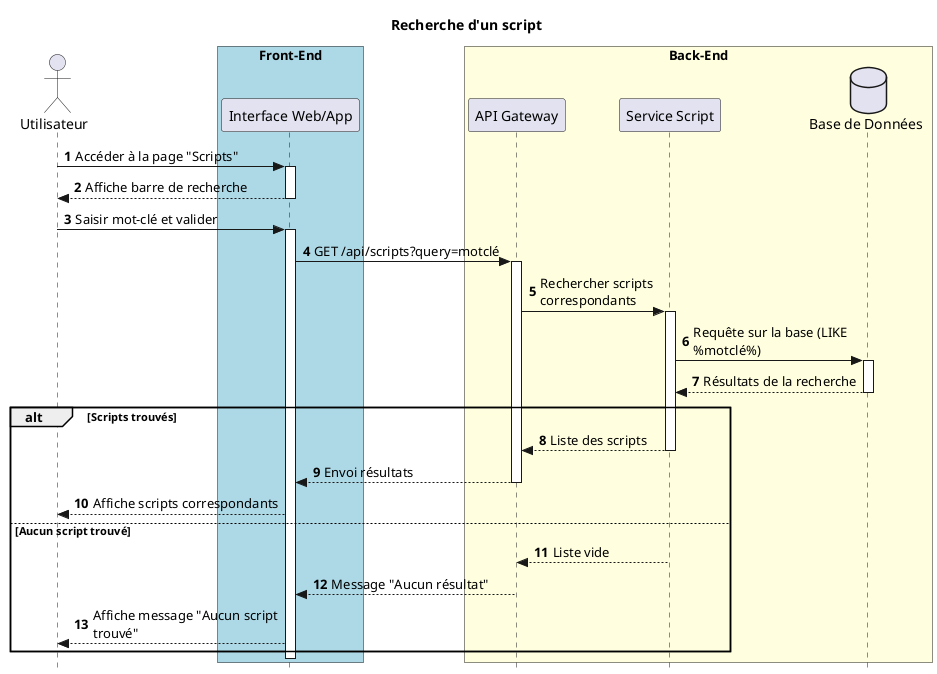
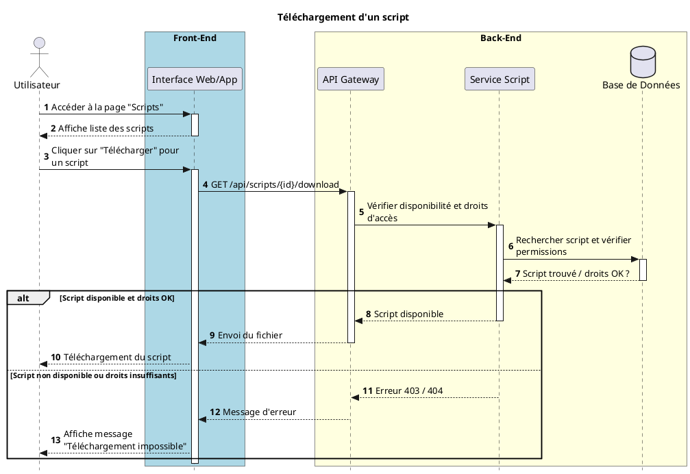
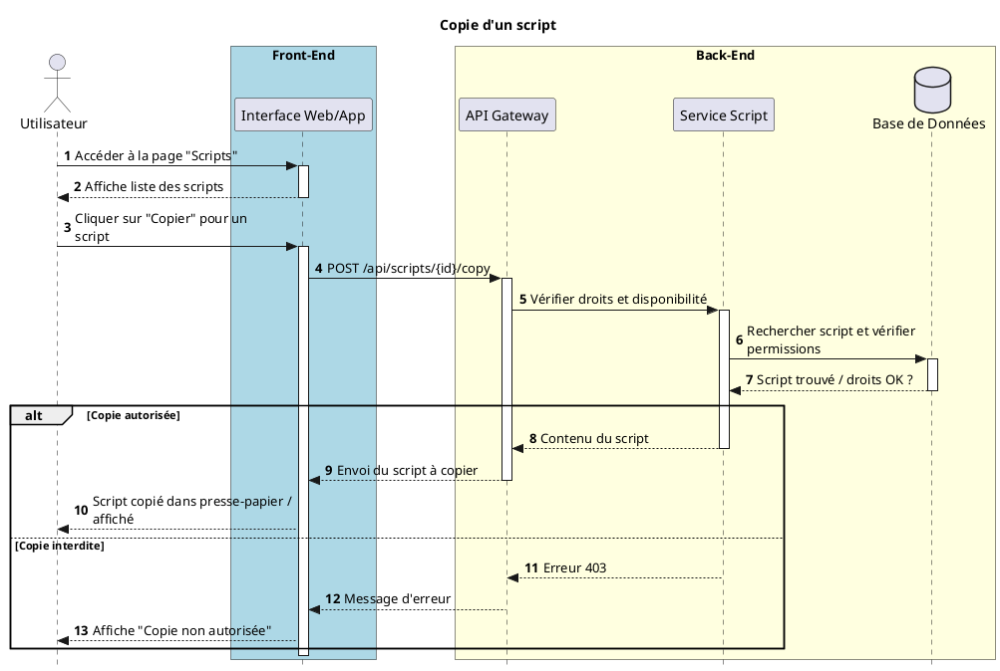
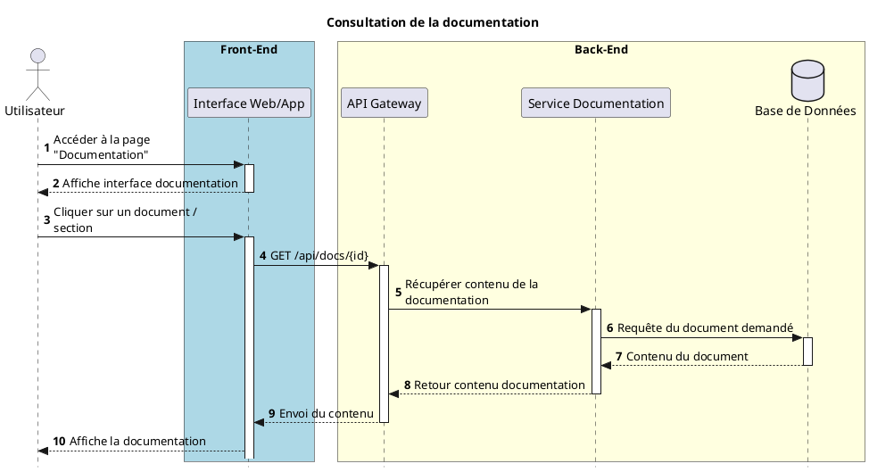
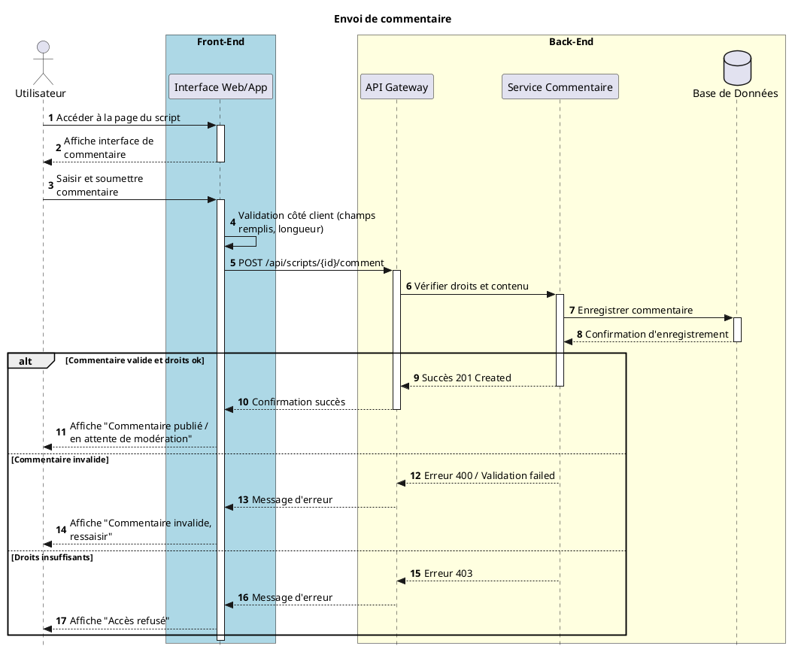
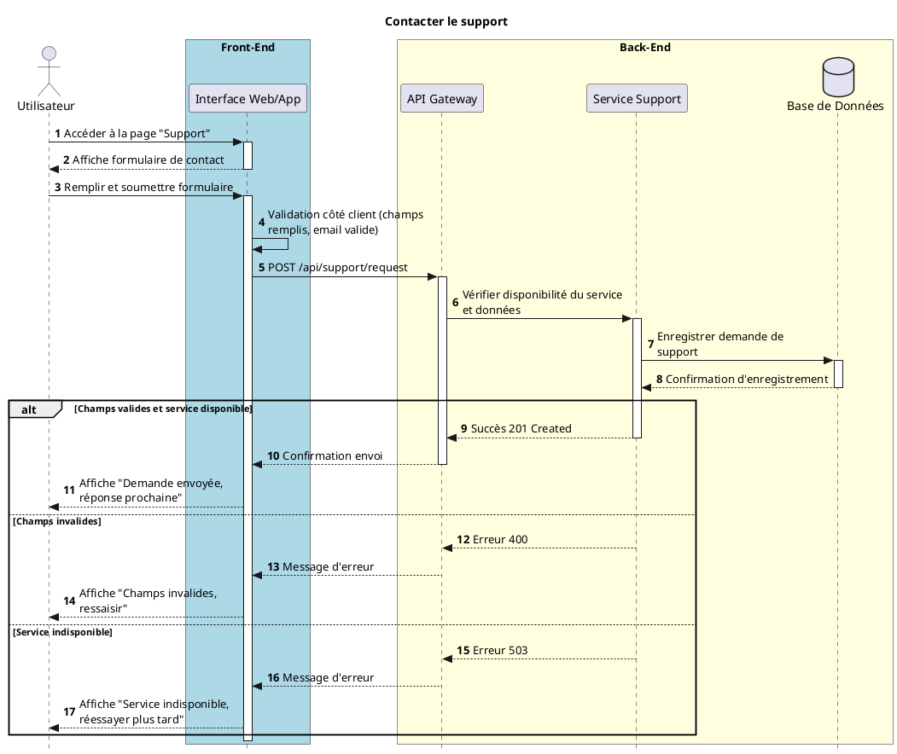

# Diagrammes de séquence

## Groupe : 24

### Membres
- Amir Minihadji AMINA  
- LO Pape  
- Neylie NDJUMKENG-NGUEMO  

### Superviseur
- Mhand BOUFALA
---

Dans cette section, nous allons décrire les diagrammes de séquence correspondant aux cas d’utilisation suivants :

- Création de compte utilisateur  
- Connexion  
- Mot de passe oublié  
- Consultation des scripts  
- Recherche d’un script  
- Téléchargement d’un script  
- Copie d’un script  
- Consultation de la documentation  
- Envoi d’un commentaire  
- Contacter le support  

### 1. Création de compte 

### 2. Connexion 

### 3. Mot de passe oublié 

### 4. Consultation des scripts

### 5. Recherche d’un script

### 6. Téléchargement d’un script

### Copie d’un script

### 8. Consultation de la documentation

### 9. Envoi d’un commentaire

### 10. Contacter le support

